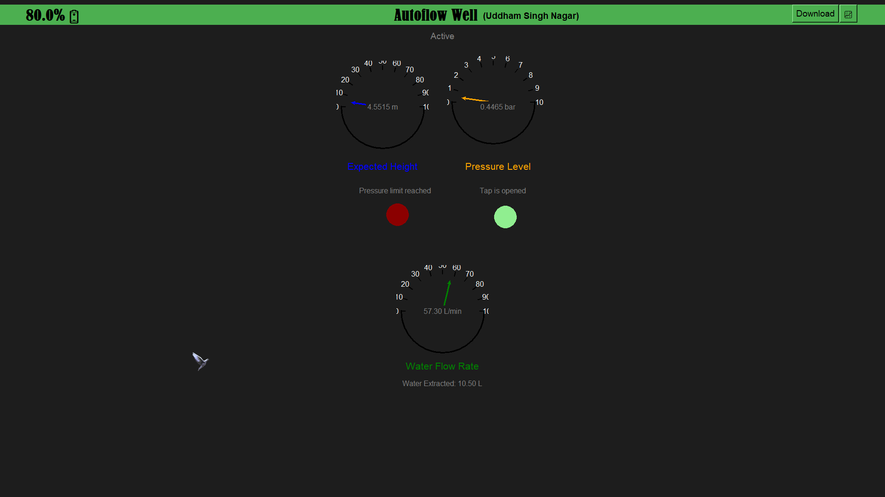
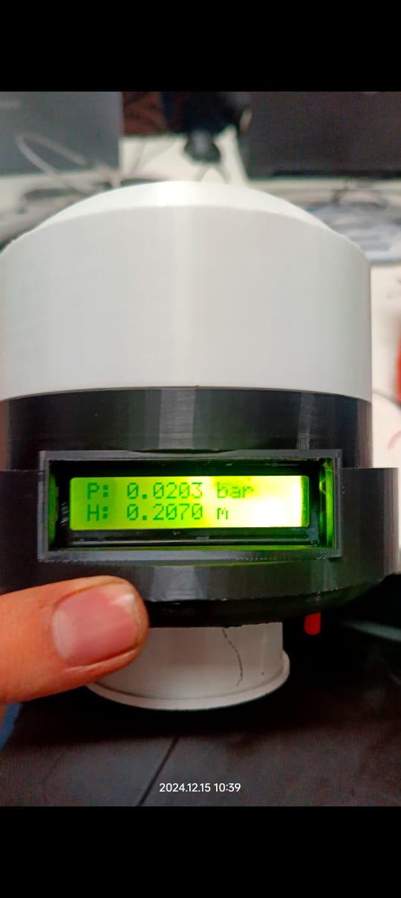
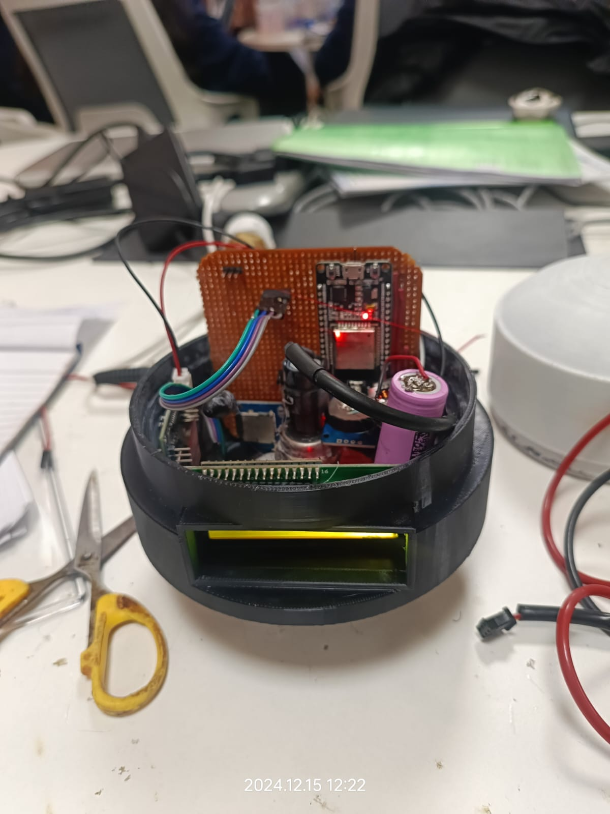

# Smart IoT Autoflow Well Cap and Management System

## Overview  

We developed a **Smart IoT Autoflow Well Cap and Management System** for artesian wells, aiming to regulate and optimize the uncontrolled flow of water caused by underground pressure. Artesian wells are natural sources of water that often flow uncontrollably, leading to significant water wastage, environmental challenges, and in some cases, contributing to landslides. Our solution addresses these issues by creating a smart system that automatically manages water flow and pressure to ensure sustainable and safe water usage.

## Problem Statement

Artesian wells, due to their high underground pressure, often experience uncontrolled water flow. This uncontrolled flow not only leads to wastage but also poses safety risks, including landslides caused by excess water. Our research revealed that no existing solution addressed the challenges posed by artesian well pressure and flow regulation, which made this project an innovative approach to an unresolved problem.

## Solution

Our **Smart IoT Autoflow Well Cap and Management System** uses modern technologies to measure, regulate, and monitor the water flow from artesian wells. Here’s how we tackled the problem:

### Key Components:
- **Pressure Transducer**: A sensor used to measure the pressure exerted by the water and convert it into a corresponding height of the water column.
- **IoT Integration**: The system uses an IoT-based platform to monitor and control water flow automatically in real-time, adjusting for pressure variations and preventing wastage.
- **Automatic Flow Regulation**: Based on pressure data, the system adjusts the flow of water from the artesian well, ensuring safe and controlled release.
  
### System Features:
- **Real-Time Monitoring**: Water pressure is continuously monitored, and any sudden changes in pressure trigger an automatic adjustment to water flow.
- **Pressure Control**: The system is designed to withstand extreme pressure and adjust the water flow accordingly, minimizing wastage.
- **Safety Measures**: The system helps prevent environmental hazards such as landslides by regulating excessive water flow.
- **Sustainable Water Usage**: By optimizing the water flow, the system ensures that the water is used efficiently, reducing wastage. 

## Challenges Faced
- **High Water Pressure**: Artesian wells are characterized by extremely high water pressure, which posed a significant challenge in designing a system that could withstand and regulate this pressure effectively.
- **Lack of Existing Solutions**: After extensive research, we discovered that no existing solutions or technologies were specifically addressing the unique challenges of artesian well pressure management. This led us to develop an entirely new system.
- **Geological and Environmental Factors**: We needed to deeply understand the local geological and environmental conditions where artesian wells are present, as well as the challenges faced by communities relying on these wells for water.

## How It Works
The **Smart IoT Autoflow Well Cap and Management System** is built on a feedback loop that ensures the water flow remains within safe, manageable levels:
1. **Pressure Measurement**: The pressure transducer continuously measures the pressure exerted by the water in the well.
2. **Data Conversion**: The measured pressure is converted into the equivalent height of the water column, providing a precise indication of the water pressure.
3. **Flow Regulation**: Based on this pressure data, the system adjusts the water flow through an automated valve system, ensuring that it is neither excessive nor insufficient.
4. **Remote Monitoring**: The system is connected to a centralized IoT platform, enabling remote monitoring of the artesian well's status and water flow.

## Installation

To set up the **Smart IoT Autoflow Well Cap and Management System**, follow the steps below:

1. **Install AutoFlow Well Cap**: Place our cap to the artesian well to continuously measure the water pressure.
2. **Connect to IoT Platform**: Integrate the system with an IoT platform to enable real-time monitoring and automatic flow adjustments.
3. **Configure Flow Control Mechanism**: Ensure the automatic flow control valves are in place to regulate water flow based on pressure readings.

## Getting Started

To get started with the project:

1. Clone the repository:
   ```bash
   git clone https://github.com/yourusername/smart-iot-autoflow-well-system.git
   ```

2. Navigate to the project directory:
   ```bash
   cd Dashboard
   ```

3. Launch the system and monitor the artesian well:
   ```bash
    python login_page.py
   ```

## Contributing

If you would like to contribute to this project, feel free to fork the repository and submit a pull request with your proposed changes.

### Steps for Contribution:
1. Fork the repository.
2. Create a new branch: `git checkout -b feature-branch`.
3. Make your changes and commit them: `git commit -am 'Add new feature'`.
4. Push to your branch: `git push origin feature-branch`.
5. Open a pull request to the `main` branch of the original repository.

## License

This project is licensed under the MIT License - see the [LICENSE](LICENSE) file for details.

---

### Images of the System

To better understand the system, we have uploaded several images of the Smart IoT Autoflow Well Cap and its components. You can view the images below:





Feel free to explore the images to see the design and implementation of the system.

